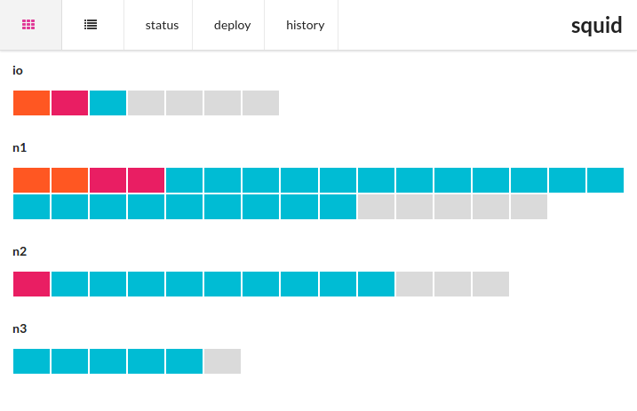

# Squid

An Agent and an API to manage containers using docker-compose.

## Getting started

On each node of your cluster:
start squid by given a `compose` directory with compose files:

```
docker run -d \
  --name squid \
  --hostname=squid-$(hostname) \
  -p 8442:4242 \
  -v $(pwd)/compose:/app/compose \
  -v /var/run/docker.sock:/var/run/docker.sock \
  --restart=always \
  krkr/squid
```

## API

```
GET /compose/status   Get the services status
GET /compose/plan     Get the list of services planned in all compose files
GET /compose/up       Run docker-compose up -d for each compose file
```

## Simple UI

Show the status of the containers described in the compose files.
A container absent has no color.

